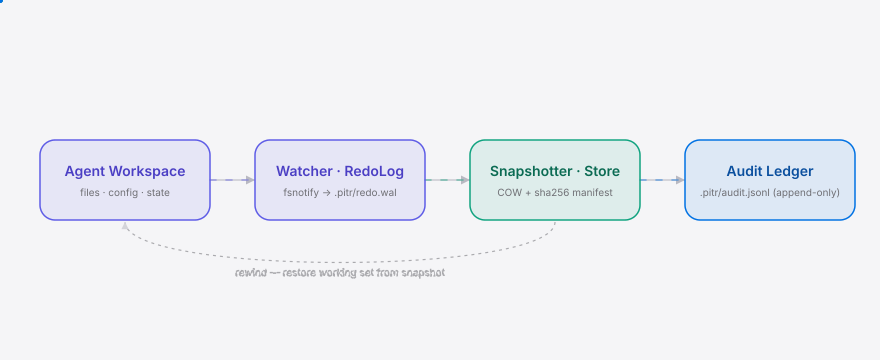

<div align="right"><sub><a href="./README.en.md">English</a>&nbsp;&nbsp;⇄&nbsp;&nbsp;<b>简体中文</b></sub></div>

<picture>
  <source media="(prefers-color-scheme: dark)" srcset="./assets/hero-dark.svg">
  <source media="(prefers-color-scheme: light)" srcset="./assets/hero-light.svg">
  
</picture>

<p align="center"><sub>信创气隙 box 上 agent 改坏文件后，pitrrwnd 用数据库 PITR 同构映射的工作集 savepoint + redo log，把工作集字节级倒回 agent 介入前的任意步骤。全程本地、留等保可审计的还原痕，操作不出境。</sub></p>

<p align="center">
  <a href="./LICENSE"></a>
  <a href="https://github.com/SuperMarioYL/pitrrwnd/releases"></a>
  <a href="https://github.com/SuperMarioYL/pitrrwnd/actions/workflows/ci.yml"></a>
  
  
</p>

---

**agent 凌晨跑坏了一条命令，改坏了 git 跟踪范围之外的配置与运行时态——`pitr rewind --step N` 秒级把工作集倒回那条命令之前，`pitr verify --step N` 仅在字节级 sha256 全匹配时退出 0。**

<h2> 架构</h2>

<picture>
  <source media="(prefers-color-scheme: dark)" srcset="./assets/atlas-dark.svg">
  <source media="(prefers-color-scheme: light)" srcset="./assets/atlas-light.svg">
  
</picture>

近 6–18 个月，coding agent 从玩具变成可跑长链路多步自主会话，单步 blast radius 从"一个文件"涨到"整个工作集被污染"——agent 改坏了 `/etc`、`~/.config`、sqlite 这些 git 够不到、VM 快照够不细的状态。这正是 Agent 编排平台 [langgenius/dify](https://github.com/langgenius/dify) 之外被反复提起的缺口：dify 把 Agent 编排做成了平台，却没有人给 agent 的工作集做 per-step 的事务日志与回滚原语。pitrrwnd 把数据库 redo-log 时间点恢复的同构映射搬到文件系统树：每个 agent 步骤一个 COW savepoint，写一次 sha256 manifest；步骤之间 fsnotify watcher 写 redo 日志；rewind 到任意步骤，verify 字节级校验。原语成熟（DB PITR），只是 agent 会话够长够自主后才值得做。

## 目录

- [为什么需要它](#为什么需要它)
- [安装与快速开始](#安装与快速开始)
- [用法](#用法)
- [Demo](#demo)
- [路线图](#路线图)
- [付费](#付费)
- [分享](#分享)
- [License](#license)

## 为什么需要它

今天运维只能 `git reset`（够不到非跟踪文件）或整盘 VM 快照（粒度粗、非按步、无审计、占空间大）。等保 2.0 要求"可审计地还原至介入前状态"，但 agent 改的配置/DB/运行时态既不在 git 里、也非整盘快照能按步触及。pitrrwnd 在本机按 agent 步骤做 savepoint，把工作集字节级倒回该步骤，redo 日志天然留可审计痕，且全程不出境。

## 安装与快速开始

<h3> 从源码构建（首次发布前）</h3>

```bash
git clone https://github.com/SuperMarioYL/pitrrwnd && cd pitrrwnd
make build
./scripts/demo.sh            # 端到端：savepoint → agent 改坏 → rewind → verify 退出 0
```

首次发布后可直接下载预编译二进制（静态 Go，零运行时依赖）：

```bash
curl -L https://github.com/SuperMarioYL/pitrrwnd/releases/latest/download/pitr-linux-amd64.tar.gz | tar xz
sudo mv pitr /usr/local/bin/
```

<details><summary>示例输出（scripts/demo.sh 节选）</summary>

```
==> pitr savepoint --label "before risky refactor"
savepoint step=1 label="before risky refactor" working_set_sha256=0cf9147b678ce60533a25e23fc77f9eeb3810447a4b7e971907ad74e662dc704
==> pitr verify --step 1   (should FAIL)
verify step 1: FAIL — verify: app.conf sha256 mismatch (want 808a.., got 4c51..)
==> pitr rewind --step 1
rewound to step 1 ("before risky refactor"); working_set_sha256=0cf9147b678ce60533a25e23fc77f9eeb3810447a4b7e971907ad74e662dc704
==> pitr verify --step 1   (should pass, byte-level equal)
verify step 1: OK (working set sha256 matches manifest)
==> pitr audit-export -o bundle.tar.gz
audit bundle written: bundle.tar.gz
  audit_sha256=aec87c191289500ea95fba98ad23176fd28d086f4d4893af25af08c93604a516
```
</details>

## 用法

<h2> 用法</h2>

所有状态都在工作集根目录的 `.pitr/` 下，单进程、前台、无守护。`pitr watch` 在 agent 工作时前台跑；`savepoint` / `rewind` / `verify` / `log` / `audit-export` 是对 `.pitr/` 的无状态子命令。

```bash
# 1. 在 agent 工作集初始化事务状态
cd ~/agent-work && pitr init

# 2. 在 agent 跑之前打一个 savepoint（COW 快照 + sha256 清单）
pitr savepoint --label "before risky refactor"

# 3. 让 agent 跑（可选：另开终端 pitr watch 记录每文件写事件的 redo 日志）
#    ...agent 改坏了 app.conf、删了 db/store.db、留下 junk.txt...

# 4. 倒回到 step 1，并字节级校验
pitr rewind --step 1
pitr verify --step 1            # 仅在 sha256 全匹配时退出 0

# 5. 查看时间线与审计痕，导出等保评审包
pitr log
pitr audit-export -o bundle.tar.gz
```

### 命令与参数

| 命令 | 关键参数 | 作用 |
|---|---|---|
| `pitr init` | `--root/-C` | 创建 `.pitr/` 状态目录（bbolt 索引 + snapshots + manifests + redo.wal + audit.jsonl） |
| `pitr watch` | `--root/-C` | 前台 fsnotify watcher，按文件写事件追加 redo 日志（Ctrl-C 停止） |
| `pitr savepoint` | `--label/-l` | 写 reflink/COW 快照 + 全文件 sha256 清单，截断 redo 日志到步骤边界 |
| `pitr rewind` | `--step/-s N` | 从快照还原工作集，删除 agent 新增文件，追加 rewind 审计条目 |
| `pitr verify` | `--step/-s N` | 逐文件哈希比对清单，仅全匹配退出 0（杀手级校验） |
| `pitr log` | `--root/-C` | 打印 savepoint 时间线 + 追加式审计痕 |
| `pitr audit-export` | `--out/-o` | 导出 tar.gz 评审包（audit.jsonl + savepoints + 清单 sha256 + 版本） |

`--root/-C` 可在任意子命令指定工作集根（默认当前目录）。

## Demo

<h2> Demo</h2>

10 分钟端到端：`pitr init` → 打 savepoint → 模拟 agent 改坏配置/删库/丢垃圾文件 → `pitr rewind --step 1` → `pitr verify --step 1` 退出 0（字节级等值）。


完整可复现脚本见 [`scripts/demo.sh`](./scripts/demo.sh)；vhs 录制脚本见 [`docs/demo.tape`](./docs/demo.tape)（`make demo` 可重新渲染 gif）。

### 与现有方案对比

| 能力 | pitrrwnd | `git reset` / worktree | VM / 容器快照 |
|---|:---:|:---:|:---:|
| 覆盖非 git 跟踪文件（`/etc`、DB、运行时态） | ✓ | — | ✓ |
| 按 agent 步骤粒度 | ✓ | —（人 commit 粒度） | —（整盘） |
| 字节级 sha256 校验退出码 | ✓ | — | — |
| 追加式审计痕（sha256 + ISO 时间戳 + host + user） | ✓ | — | partial |
| 全本地、不出境、静态二进制零网络依赖 | ✓ | ✓ | partial |
| 分布式协作 / 分支语义 | — | ✓（git 更强） | — |

诚实地说：git 在分布式协作与分支语义上远胜 pitrrwnd——pitrrwnd 不取代 git，只补 git 够不到的 per-step 字节级回滚与审计缺口。

## 路线图

<h2> 路线图</h2>

- [x] **m1 快照与 savepoint** — `pitr init` 建 `.pitr/`；`pitr savepoint` 写 reflink/COW 快照 + sha256 清单；`pitr verify --step N` 退出 0（ext4 + XFS）。
- [x] **m2 回滚还原** — `pitr rewind --step N` 从快照还原工作集，追加审计条目；`verify --step N` 字节级等值。
- [x] **m3 日志、审计、demo** — `pitr log` 时间线 + 审计痕；`pitr audit-export` 等保评审包；`scripts/demo.sh` 可复现。
- [ ] sub-savepoint redo-log 重放（`pitr rewind --to TIMESTAMP`，v0.2）
- [ ] Claude Code / Cursor wrapper（`scripts/claude-code-hook.sh`，v0.2）
- [ ] 龙芯 / LoongArch 预编译二进制
- [ ] 快照库去重 / 压缩（超出 hardlink 之外）
- [ ] 加密静态快照库

## 付费

<h2> 付费</h2>

核心 PITR 引擎与本地 `.pitr/audit.jsonl` + `audit-export` 等保评审包永久开源（MIT），单机静态二进制完整可用、核心回滚永不设限。

面向信创/等保合规运维与 on-prem LLM 多机 agent 集群的**团队计划**（运行在气隙内，不上云）：

- **多机中央审计看板**：聚合各机 `.pitr/audit.jsonl` 成单一等保可审视图
- **LoongArch / 龙芯预编译二进制**
- **等保评审包模板**（可签名）+ SLA + on-prem license key
- **定价**：¥6,800 / 机 / 年，5 机起（¥34k/年起）；首批 3 家信创客户 Q4 试点 ¥3,000 / 机 首年
- **计费**：对公转账发票 + license-key 授权（气隙禁止 Stripe / 云计量）
- **最小成交路径**：在其 staging 信创机 30 分钟远程——`pitr init` → agent 改坏配置 → `pitr rewind --step 1` + `pitr audit-export` → 等保评审员当场签名评审包 → 14 天内出 PO

意向试点或商务洽谈：开 issue 标 `commercial` 或邮件联系。

## 分享

```
pitrrwnd — 给 agent 工作集做文件系统 PITR。数据库 redo-log 同构映射，按 agent 步骤字节级回滚到介入前任意点，verify 退出 0 才算还原，全程本地留等保审计痕。https://github.com/SuperMarioYL/pitrrwnd
```

## License

<h2> License</h2>

MIT — 见 [LICENSE](./LICENSE)。提 issue 或 PR 欢迎；商务/合规需求见上方[付费](#付费)。

<p align="center"><sub><a href="./LICENSE">MIT</a> © 2026 SuperMarioYL</sub></p>
